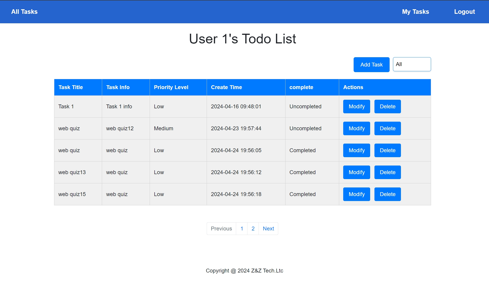
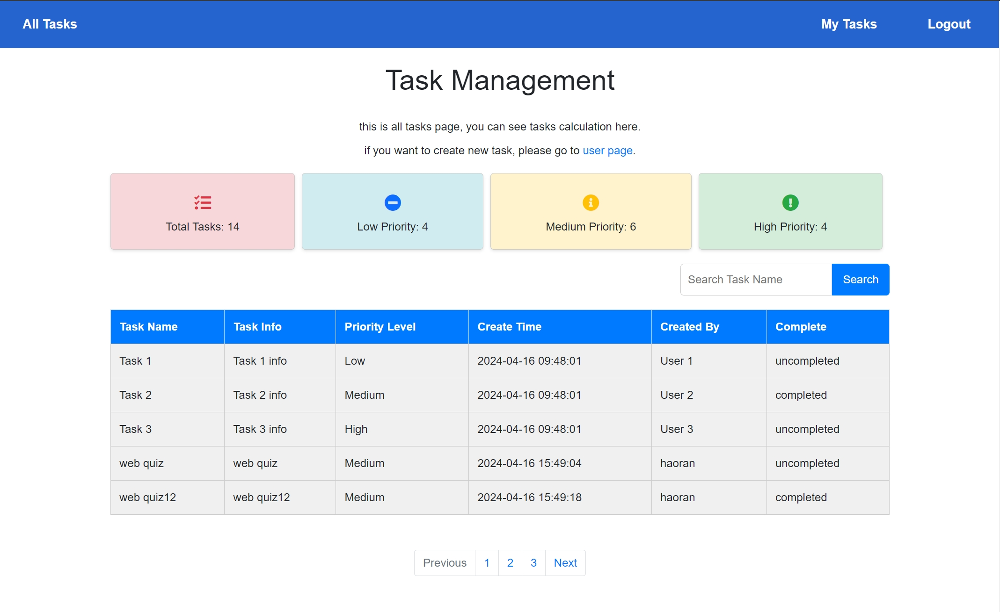

## Versions
The first version finised at April-02-2024.
The second version begin at April-23-2024.

## Features

### User Registration and Authentication
- **Sign up:** Create your ToDoList account using a username and password. Follow the step-by-step guide for a secure registration process.

### Task Management
- **Adding New Tasks:** Easily add new tasks by clicking on 'Add Task' and entering details such as task title, information, priority level, and creation time.
- **Modify Tasks:** Update task details anytime by clicking on the 'Modify Task' button.
- **Deleting Tasks:** Remove tasks from your list with a single click using the 'Delete' button associated with each task.

### Search and Filtering
- **Search Functionality:** Quickly find specific tasks by title or other criteria using the search feature.
- **Filter Tasks:** Focus on what matters most by filtering tasks based on priority level or creation time.

### Overview
ToDoList offers a user-friendly platform for efficient task management. For any questions or assistance, feel free to reach out. Happy organizing!

## Detais about new version
TODO List function fix
1. Change the search function.
TODO List function expansion
1. Use bootstrap
Implement paging function: Next page Total number of pages Number of jump pages.
- filter each column.
- search each column.

## what I will do for next version
2. Login verification, role permission management.
3. Can integrate other SSO login functions, such as Google login.
